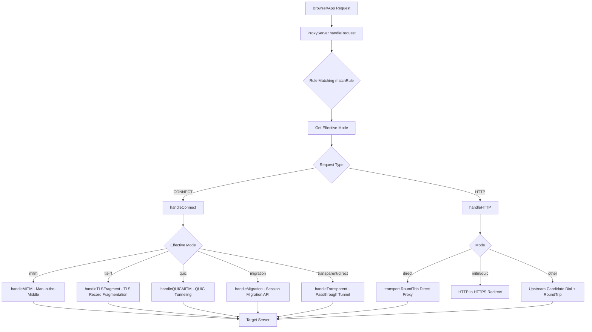
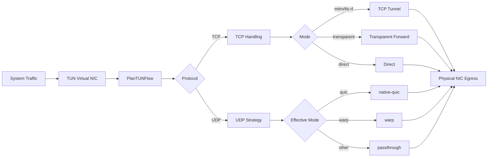

# SniShaper

[中文](README.md) | [English](README_EN.md) | [Русский](README_RU.md)

[](https://golang.org)
[]()
[](https://github.com/SniShaper/SniShaper/wiki)
[](https://github.com/SniShaper/SniShaper/releases)
[](https://github.com/SniShaper/SniShaper/releases)
[](https://github.com/SniShaper/SniShaper/commits/main)
[](https://github.com/SniShaper/SniShaper/actions)

**SniShaper** is a local proxy tool designed for complex network environments, integrating **ECH Injection**, **TLS Fragmentation**, **QUIC Obfuscation**, **Session Migration**, and other protocol stack technologies, paired with a **TUN Virtual NIC** for full traffic takeover, delivering a stable and flexible browsing experience.

---

## Core Request Flow



## TUN Virtual NIC Flow



---

## Features

- **Multi-Mode Proxy**: MITM, Transparent, TLS-RF (TLS Fragmentation), QUIC, Migration (session persistence), Direct -- covering diverse scenarios.
- **TUN Virtual NIC**: Native TUN support for transparent global traffic hijacking, auto-routing and DNS hijacking.
- **ECH Injection**: Automatically fetches and injects ECH Config, with DoH discovery and hot-reload.
- **Smart Routing**: Auto-identifies blocked domains based on GFWList; routing engine works without manual config.
- **Encrypted DNS**: Built-in anti-pollution DNS resolver with multi-node failover.
- **Cloudflare IP Pool**: Auto speed-test, health check, and refresh.
- **NAT64 Support**: Flexible IP egress and service access.

---

## Quick Start

### 1. Run
Download the [latest release](https://github.com/SniShaper/SniShaper/releases) and run `snishaper.exe`. The app requests admin elevation (required for TUN mode). If elevation fails, TUN is unavailable but other features work normally.

<a href="https://apps.microsoft.com/detail/9n11mrrsfs8n" target="_self">

</a>

### 2. Certificate Re-install
In the main UI click **Certificate Management -> Reset Root Certificate**.

### 3. Configure and Start
The software includes a rich set of built-in rules. You can also customize rules in the **Rule Panel**, then click **Start Proxy**.

---

## Documentation

For detailed technical principles, deployment tutorials, and customization guides, refer to the [**GitHub Wiki**](https://github.com/SniShaper/SniShaper/wiki):

- **[Core Mode Introduction](https://github.com/SniShaper/SniShaper/wiki/Core-Proxy-Modes)**: Understand TLS-RF, QUIC and Server mode operation.
- **[Rule Customization Guide](https://github.com/SniShaper/SniShaper/wiki/Custom-Rules-Guide)**: Learn how to develop targeted rules.
- **[GUI Configuration Practice](https://github.com/SniShaper/SniShaper/wiki/GUI-Configuration)**: Quickly configure rules in the GUI.
- **[FAQ](https://github.com/SniShaper/SniShaper/wiki/FAQ)**: Resolve certificate warnings, rule issues and other common problems.

---

## Build and Development

This project is built with **Wails v3**.

```powershell
# Clone the repository
git clone https://github.com/SniShaper/snishaper.git
cd snishaper

# Install frontend dependencies
cd frontend
npm install

# Build frontend static resources
npm run build
cd ..

# Full compilation (interactive mode)
powershell -ExecutionPolicy Bypass -File .\build_windows.ps1

# Or with PowerShell 7
pwsh -ExecutionPolicy Bypass -File .\build_windows.ps1

# Go main program compilation (script auto-runs go mod download)
go build -tags with_gvisor -ldflags="-s -w" -o "build/bin/snishaper.exe"
```

### Build Script Command-Line Parameters

`build_windows.ps1` supports the following parameters to skip interactive prompts:

| Parameter | Values | Description |
| ------------- | ------------------------------ | ---------------------------------------------------------------- |
| `-Build` | `frontend` / `backend` / `all` | Specify build target |
| `-Lang` | `en` / `cn` / `ru` | Specify interface language |
| `-InstallDeps` | No value (switch) | Install frontend npm dependencies |
| `-BuildMsix` | No value (switch) | Build MSIX installer package |
| `-SkipSign` | No value (switch) | Skip MSIX signing, output file gets `unsigned_` prefix (requires `-BuildMsix`) |
| `-Silent` | No value (switch) | Silent mode, skip all interactive prompts |

**Usage examples:**

```powershell
# Build frontend only (Chinese interface)
.\build_windows.ps1 -Build frontend -Lang cn

# Build backend only (English interface)
.\build_windows.ps1 -Build backend -Lang en

# Build both frontend and backend with dependency install
.\build_windows.ps1 -Build all -Lang cn -InstallDeps

# Build both and generate MSIX package (signed by default)
.\build_windows.ps1 -Build all -BuildMsix

# Build both and generate unsigned MSIX (skip signing)
.\build_windows.ps1 -Build all -BuildMsix -SkipSign

# Silent mode (for CI/CD, no interaction)
.\build_windows.ps1 -Silent

# Silent mode with build and packaging (skip signing)
.\build_windows.ps1 -Build all -Silent -BuildMsix -SkipSign

# No parameters = interactive mode (original behavior)
.\build_windows.ps1
```

Development environment recommendations:

- `Go 1.25+`
- `Node.js 24+`
- `npm 11+`
- `gVisor` (required for TUN mode, Linux: install `gvisor` package)

Build outputs:

- Frontend assets at `frontend/dist`
- Executable at `build/bin/snishaper.exe`

---

## Cross-platform

Supports Windows and Linux platforms. For the Linux version, refer to [Linux Version](https://github.com/dongzheyu/SniShaper-Linux/).

## Acknowledgements

This project has benefited from the inspiration of the following excellent open-source projects:

- [DoH-ECH-Demo](https://github.com/0xCaner/DoH-ECH-Demo)
- [lumine](https://github.com/moi-si/lumine)

## Contributors

Thanks to the following contributors for their contributions to this repository:

| <a href="https://github.com/mechrevo"></a> | <a href="https://github.com/dongzheyu"></a> | <a href="https://github.com/JetCPP-dongle"></a> |
| :----------------------------------------------------------: | :----------------------------------------------------------: | :----------------------------------------------------------: |
| [mechrevo](https://github.com/mechrevo) | [dongzheyu](https://github.com/dongzheyu) | [JetCPP-dongle](https://github.com/JetCPP-dongle) |

## Star History

<a href="https://www.star-history.com/?repos=snishaper/snishaper&type=date&legend=top-left">
 <picture>
   <source media="(prefers-color-scheme: dark)" srcset="https://api.star-history.com/chart?repos=snishaper/snishaper&type=date&theme=dark&legend=top-left" />
   <source media="(prefers-color-scheme: light)" srcset="https://api.star-history.com/chart?repos=snishaper/snishaper&type=date&legend=top-left" />
   
 </picture>
</a>

---

## Project Activity & Contributors

### Activity Badges

[](https://github.com/SniShaper/SniShaper/graphs/contributors)
[](https://github.com/SniShaper/SniShaper/graphs/contributors)
[](https://github.com/SniShaper/SniShaper/commits/main)

### Activity Trend

<div align="center">
<a href="https://repobeats.axiom.co/" target="_blank">

</a>
</div>

### Core Contributors

<div align="center">
<a href="https://github.com/SniShaper/SniShaper/graphs/contributors" target="_blank">

</a>
</div>

---

## License

[MIT License](LICENSE)