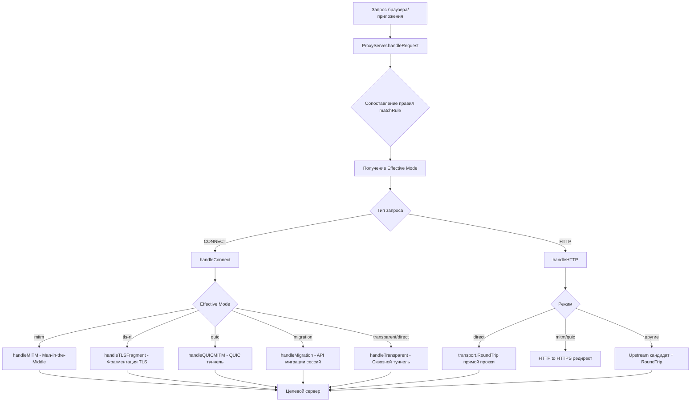
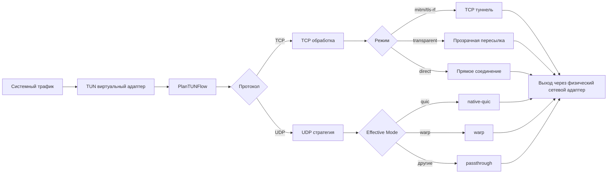

# SniShaper

[中文](README.md) | [English](README_EN.md) | [Русский](README_RU.md)

[](https://golang.org)
[]()
[](https://github.com/SniShaper/SniShaper/wiki)
[](https://github.com/SniShaper/SniShaper/releases)
[](https://github.com/SniShaper/SniShaper/releases)
[](https://github.com/SniShaper/SniShaper/commits/main)
[](https://github.com/SniShaper/SniShaper/actions)

**SniShaper** -- это локальный прокси-инструмент, разработанный специально для сложных сетевых условий, интегрирующий **инъекцию ECH**, **фрагментацию TLS**, **маскировку QUIC**, **миграцию сессий** и другие технологии стека протоколов, в сочетании с **виртуальным TUN-интерфейсом** для полного перехвата трафика, обеспечивая стабильный и гибкий доступ в интернет.

---

## Основной поток обработки запросов



## Поток TUN виртуального сетевого адаптера



---

## Возможности

- **Многорежимное прокси**: MITM, Transparent, TLS-RF (фрагментация TLS), QUIC, Migration (перенос сессий), Direct -- для различных сценариев.
- **TUN виртуальный сетевой адаптер**: нативная поддержка TUN для прозрачного глобального перехвата трафика, авто-маршрутизации и перехвата DNS.
- **Инъекция ECH**: автоматическое получение и внедрение ECH Config с DoH-обнаружением и горячей заменой.
- **Интеллектуальная маршрутизация**: автоматическое определение заблокированных доменов на основе GFWList без ручной настройки.
- **Шифрованный DNS**: встроенный защищённый DNS-резолвер с балансировкой узлов.
- **Cloudflare IP пул**: автоматическое измерение скорости, проверка работоспособности и обновление.
- **NAT64 поддержка**: гибкий IP-выход и доступ к сервисам.

---

## Быстрый старт

### 1. Запуск
Скачайте [последнюю версию](https://github.com/SniShaper/SniShaper/releases) и запустите `snishaper.exe`. Приложение автоматически запрашивает права администратора (требуются для TUN). Если повышение прав не удалось, TUN недоступен, но остальные функции работают.

<a href="https://apps.microsoft.com/detail/9n11mrrsfs8n" target="_self">

</a>

### 2. Переустановка сертификата
В главном интерфейсе нажмите **Управление сертификатами -> Сбросить корневой сертификат**.

### 3. Настройка и запуск
Программа поставляется с богатым набором встроенных правил. Вы также можете настроить собственные правила на панели правил и нажать **Запустить прокси**.

---

## Документация

Для получения подробных технических принципов, руководств по развертыванию и настройке, обратитесь к [**GitHub Wiki**](https://github.com/SniShaper/SniShaper/wiki):

- **[Основные режимы прокси](https://github.com/SniShaper/SniShaper/wiki/Core-Proxy-Modes)**: понимание принципов работы TLS-RF, QUIC и серверного режима.
- **[Руководство по правилам](https://github.com/SniShaper/SniShaper/wiki/Custom-Rules-Guide)**: как разрабатывать целевые правила.
- **[Настройка GUI](https://github.com/SniShaper/SniShaper/wiki/GUI-Configuration)**: быстрая настройка правил в интерфейсе.
- **[Устранение неполадок](https://github.com/SniShaper/SniShaper/wiki/FAQ)**: решение проблем с сертификатами, правилами и другим.

---

## Сборка и разработка

Проект построен с использованием **Wails v3**.

```powershell
# Клонировать репозиторий
git clone https://github.com/SniShaper/snishaper.git
cd snishaper

# Установить зависимости фронтенда
cd frontend
npm install

# Собрать статические ресурсы фронтенда
npm run build
cd ..

# Полная компиляция за один шаг (интерактивный режим)
powershell -ExecutionPolicy Bypass -File .\build_windows.ps1

# Или с PowerShell 7
pwsh -ExecutionPolicy Bypass -File .\build_windows.ps1

# Компиляция основной программы на Go (скрипт автоматически выполняет go mod download)
go build -tags with_gvisor -ldflags="-s -w" -o "build/bin/snishaper.exe"
```

### Параметры командной строки скрипта сборки

`build_windows.ps1` поддерживает следующие параметры для пропуска интерактивных запросов:

| Параметр | Значения | Описание |
| ------------ | -------------------------------- | ------------------------------------------------------------------ |
| `-Build` | `frontend` / `backend` / `all` | Цель сборки |
| `-Lang` | `en` / `cn` / `ru` | Язык интерфейса |
| `-InstallDeps` | без значений (флаг) | Установить npm зависимости |
| `-BuildMsix` | без значений (флаг) | Собрать MSIX-пакет |
| `-SkipSign` | без значений (флаг) | Пропустить подпись MSIX, выходной файл будет иметь префикс `unsigned_` (требуется `-BuildMsix`) |
| `-Silent` | без значений (флаг) | Тихий режим, пропуск всех интерактивных запросов |

**Примеры использования:**

```powershell
# Собрать только фронтенд (китайский интерфейс)
.\build_windows.ps1 -Build frontend -Lang cn

# Собрать только бэкенд (английский интерфейс)
.\build_windows.ps1 -Build backend -Lang en

# Собрать всё и установить зависимости
.\build_windows.ps1 -Build all -Lang cn -InstallDeps

# Собрать всё и создать MSIX-пакет (подписан по умолчанию)
.\build_windows.ps1 -Build all -BuildMsix

# Собрать всё и создать неподписанный MSIX (пропустить подпись)
.\build_windows.ps1 -Build all -BuildMsix -SkipSign

# Тихий режим (для CI/CD, без взаимодействия)
.\build_windows.ps1 -Silent

# Тихий режим со сборкой и созданием пакета (пропуск подписи)
.\build_windows.ps1 -Build all -Silent -BuildMsix -SkipSign

# Без параметров = интерактивный режим
.\build_windows.ps1
```

Рекомендации по окружению разработки:

- `Go 1.25+`
- `Node.js 24+`
- `npm 11+`
- `gVisor` (требуется для TUN режима, Linux: установить пакет `gvisor`)

Результаты сборки:

- Ресурсы фронтенда находятся в `frontend/dist`
- Исполняемый файл находится в `build/bin/snishaper.exe`

---

## Кроссплатформенность

Программа поддерживает платформы Windows и Linux. Для версии Linux обратитесь к [Linux версия](https://github.com/dongzheyu/SniShaper-Linux/).

## Благодарности

Проект вдохновлен следующими отличными open-source проектами:

- [DoH-ECH-Demo](https://github.com/0xCaner/DoH-ECH-Demo)
- [lumine](https://github.com/moi-si/lumine)

## Участники

Благодарим следующих участников за их вклад в этот репозиторий:

| <a href="https://github.com/mechrevo"></a> | <a href="https://github.com/dongzheyu"></a> | <a href="https://github.com/JetCPP-dongle"></a> |
| :----------------------------------------------------------: | :----------------------------------------------------------: | :----------------------------------------------------------: |
| [mechrevo](https://github.com/mechrevo) | [dongzheyu](https://github.com/dongzheyu) | [JetCPP-dongle](https://github.com/JetCPP-dongle) |

## История звёзд

<a href="https://www.star-history.com/?repos=snishaper/snishaper&type=date&legend=top-left">
 <picture>
   <source media="(prefers-color-scheme: dark)" srcset="https://api.star-history.com/chart?repos=snishaper/snishaper&type=date&theme=dark&legend=top-left" />
   <source media="(prefers-color-scheme: light)" srcset="https://api.star-history.com/chart?repos=snishaper/snishaper&type=date&legend=top-left" />
   
 </picture>
</a>

---

## Активность проекта и участники

### Значки активности

[](https://github.com/SniShaper/SniShaper/graphs/contributors)
[](https://github.com/SniShaper/SniShaper/graphs/contributors)
[](https://github.com/SniShaper/SniShaper/commits/main)

### Тренд активности

<div align="center">
<a href="https://repobeats.axiom.co/" target="_blank">

</a>
</div>

### Основные участники

<div align="center">
<a href="https://github.com/SniShaper/SniShaper/graphs/contributors" target="_blank">

</a>
</div>

---

## Лицензия

[MIT License](LICENSE)